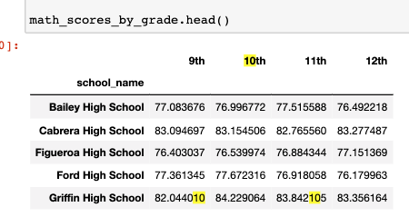
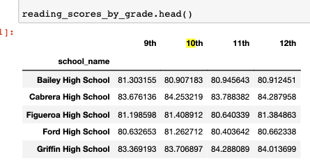

# School District Analysis

## Overview of Project
The school board has notified Maria and her supervisor that the students_complete.csv file shows evidence of academic dishonesty; specifically, reading and math grades for Thomas High School ninth graders appear to have been altered. Although the school board does not know the full extent of the academic dishonesty, they want to uphold state-testing standards and have turned to Maria for help. She has asked us to replace the math and reading scores for Thomas High School with NaNs while keeping the rest of the data intact. Once we’ve replaced the math and reading scores, Maria would like us to do the school district analysis and write up a report to describe how these changes affected the overall analysis.

## Results & Analysis
This project consists of two technical analysis deliverables.

**Deliverable 1**

Here using the Pandas loc method with conditional statements and comparison and logical operators, selecting the ninth-grade reading and math scores for Thomas High School. Then, using the Pandas NumPy module to change the reading and math scores to "NaN", which represents a "Not-a-Number" value.

Below is the screenshot showing the results/output.

 
**Deliverable 2**

- How is the  District School Summary affected?

Here is the screenshot showing the summary of the school district.

After evaluating, we noticed that there was a drop in the average math score, the % passing math, the % passing reading & the % for overall passing by 0.1, 0.2%, 0.3% & 0.1%  whereas the average reading score stayed the same.

- How was the school summary affected?

Here is the screenshot showing the summary of the school.

We noticed that there were drop in the average math score, % passing math, % passing Reading & % overall passing by 0.067, 0.086%, 0.290%, 0.317% , whereas the an increase in the average reading score by 0.0471

- How does replacing the ninth graders’ math and reading scores affect Thomas High School’s performance relative to the other schools?

We observed a drop in the % overall passing by 0.317% when we replaced the ninth graders math & reading scores to NaN for Thomas High School.

- How does replacing the ninth-grade scores affect the following:
1. Math and reading scores by grade

Here is the screenshot showing the math & reading scores by grade.

2. Scores by school spending

Here is the screenshot showing the scores by school spending.

3. Scores by school size

Here is the screenshot showing the scores by school size.

4. Scores by school type

Here is the screenshot showing the summary of the school.

After assessing the above data, we noticed that, there were no changes in the data for the math & reading score by grade, scores by school spending, scores by school size & scores by school type.

 ## Summary
Changing the reading & math scores for the ninth grade at the Thomas High School to NaN's did affect the average math, % passing math, % passing reading & the % overall passing.

